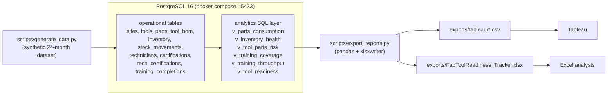

# fabtoolreadiness

Semiconductor fabs run 24/7 on hundreds of tools, and every tool is one
unavailable spare part or one missing certification away from downtime. This
project tracks spare-parts inventory and technician training coverage per
fab tool and combines them into a single readiness score per tool, so
operations teams can answer one question — *which tools are most likely to
go down next?* — before a stockout or a coverage gap turns into lost wafer
starts. It ingests inventory movements and training records into PostgreSQL,
rolls them up through SQL views into risk signals (stockouts, days of
supply, expiring certifications, single-point-of-failure coverage), and
exports analyst-ready deliverables to Tableau CSVs and a formatted Excel
tracker.

## Architecture



## Data model

| Table | Grain | Key columns | Notes |
|---|---|---|---|
| `sites` | site | `site_code`, `region` | 4 sites |
| `tools` | tool | `site_id` FK, `tool_code`, `tool_type`, `criticality` 1-5 | ~250 tools |
| `parts` | part | `part_number`, `unit_cost`, `lead_time_days`, `is_consumable` | ~120 parts |
| `tool_bom` | tool x part | PK `(tool_id, part_id)`, `qty_per_tool` | 5-15 parts per tool |
| `inventory` | site x part | PK `(site_id, part_id)`, `on_hand_qty`, `reorder_point`, `safety_stock` | checked `on_hand_qty >= 0` |
| `stock_movements` | movement | `qty_delta` (!= 0), `movement_type` in receipt/consumption/adjustment/scrap | ~40k rows, 24 months |
| `technicians` | technician | `employee_code`, `shift` A-D, `is_active` | ~600 techs |
| `certifications` | certification | `cert_code`, `tool_type`, `validity_months` | ~20 certs |
| `tech_certifications` | tech x cert | PK `(tech_id, cert_id)`, `status` active/expired/in_progress | `expires_date > earned_date` |
| `training_completions` | enrollment | `enrolled_date`, `completed_date` NULL, `hours_spent` | stale rows = never completed |

## Metric definitions

| Metric | Formula | Notes |
|---|---|---|
| `avg_daily_usage_90d` | rolling 3-month consumption sum ÷ 90 | per site x part, from `v_parts_consumption` |
| `days_of_supply` | `on_hand_qty / NULLIF(avg_daily_usage_90d, 0)` | NULL when there is no usage history |
| `coverage_ratio` | `certified_techs / 2` | target = 2 certified techs per tool_type x site x shift |
| `parts_risk_score` | `Σ` over BOM parts: stockout `10 × (1 + lead_time/90)`, below reorder `4 × (1 + lead_time/90)`, days_of_supply < 30 → `2`; capped at 100 | stockouts weighted heaviest, scaled by lead time |
| `training_risk_score` | uncovered shift `20`, SPOF shift `10`, cert expiring within 90d `2` (capped 10); capped at 100 | from `v_training_coverage` |
| `readiness_score` | `100 − (0.55 × parts_risk + 0.45 × training_risk) × (1 + (criticality − 1) × 0.1)` | criticality amplifies risk; floored at 0 |
| `risk_band` | `critical` < 30, `at_risk` < 55, `watch` < 75, else `healthy` | from `v_tool_readiness` |

## Quickstart

```sh
cp .env.example .env           # set a real password
make reset                     # db up -> schema -> lookups -> synthetic data
make all                       # refresh views -> quality checks -> exports -> findings
```

| Target | What it does |
|---|---|
| `make up` | start Postgres 16 (`fabtool` db on host port 5433) |
| `make schema` / `make seed` | apply DDL / seed lookups + synthetic data |
| `make reset` | teardown, full rebuild, prints table row counts |
| `make analytics` | (re)create the 6 analytics views, `00_as_of.sql` first |
| `make refresh` | refresh the materialized views in dependency order |
| `make export` | write `exports/tableau/*.csv` + `exports/FabToolReadiness_Tracker.xlsx` |
| `make all` | `scripts/refresh_all.py`: refresh -> data quality -> export -> regenerate FINDINGS.md |
| `make check` | `scripts/data_quality.py`: FK orphan scan + invariant checks |
| `make test` | run the pytest suite against a throwaway schema |
| `make lint` | run ruff over `scripts/` and `tests/` |

`python scripts/export_reports.py --site ALL --as-of YYYY-MM-DD --out exports/`
supports point-in-time snapshots: the materialized views are refreshed with
`fabtool.as_of` set inside a rolled-back transaction, so the database is
never left in a historical state.

## Results

Three headline findings from the seeded dataset (full readout:
[docs/FINDINGS.md](docs/FINDINGS.md)):

- **120 of 250 tools (48%)** are flagged critical or at-risk for downtime
  readiness — 19 critical, 101 at-risk.
- **Spare parts are the dominant driver**: 72 of 480 part/site bins are at
  zero stock, exposing 208 tools (83%), while ~$211k sits in excess/obsolete
  stock.
- **Training coverage is patchy**: only ~68% of tool-type/site/shift cells
  meet the 2-certified-tech target; shift D is thinnest, and CMP/AMHS tool
  families average the lowest coverage ratios.

Build and publish the dashboard with
[docs/TABLEAU_GUIDE.md](docs/TABLEAU_GUIDE.md).

**Tableau dashboard:**
[Fab Tool Readiness](https://10ay.online.tableau.com/#/site/skasired649-bcfa170192/workbooks/4744145/views)

## Testing & validation

- `pytest` (`tests/`): runs against a throwaway schema seeded with a small
  deterministic fixture (`tests/fixture_seed.sql`, as-of date pinned to
  2026-01-15). Covers constraint enforcement, hand-computed inventory
  aggregates, training coverage and 90-day expiry boundaries, readiness
  scoring/bands, and the export deliverables.
- `scripts/data_quality.py`: post-load check suite — orphan FK scan across
  all foreign keys, negative on-hand, BOM parts missing from `parts`, certs
  expiring before earned, duplicate movement IDs, tools with no BOM.
  Prints a pass/fail table and exits non-zero on any failure.
- CI (`.github/workflows/ci.yml`): Postgres 16 service, schema + fixture
  seed, `pytest` and `make check` on every push and PR.

## Screenshots

> Placeholder: insert screenshots of the Excel tracker here (Summary KPIs
> and charts, Reorder Tracker conditional formatting, Training Tracker
> expiry highlighting, At-Risk Tools ranking) and of the Tableau dashboard
> built on `exports/tableau/`.
